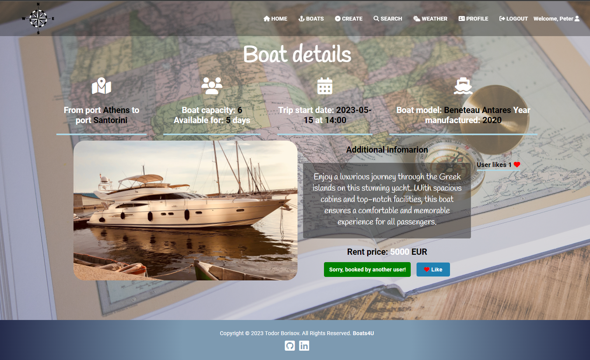
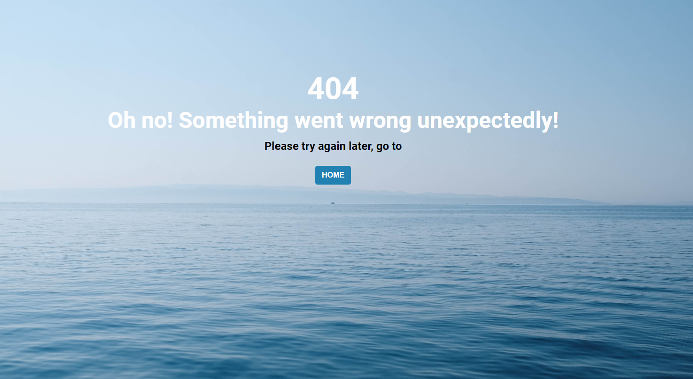

## Project Overview Boats4U 

- Welcome to the Boats4U rental application, where users can embark on unforgettable boating experiences. This platform simplifies the process of renting boats and yachts for specific durations at particular prices, facilitating seamless interactions between boat owners and enthusiasts seeking memorable water adventures
- Logged-in users have the ability to effortlessly create unique offers for their boats or yachts. This empowers boat owners to showcase their vessels' amenities, schedules, and pricing details for potential renters
- Users navigate an intuitive interface to discover an array of boat trip options suited for their summer vacation desires. They can explore various offers, filtering by preferences such as location, duration, boat type, price, year or even by a word
- The platform serves as a bridge between boat owners and vacation seekers, allowing users to easily book available offers. It streamlines the booking process, fostering a smooth communication channel between renters and boat owners
- The main goal of this app is to revolutionize the way people plan and experience boating vacations. By providing a centralized boat rental platform, I hope this app will simplify the process, making it accessible, enjoyable and convenient for boat owners and vacationers alike
- Front end is built using React. For the back-end, i have integrated the application with the SoftUni practice server

## To install and preview locally, follow these steps:

1. Clone the repository to your local machine
2. Navigate to the server folder to start the server (cd .\server\)
    - Start the server with (node .\server.js) command to start the back-end
3. Navigate to the client folder (cd .\client\)
    - npm install - command for install all packages and dependencies
    - npm run dev - to start the development server and run the app
    - open your browser and go to http://localhost:5173 to access the application

## Project Depoyed
The application is successfully deployed, allowing users to experience its features and functionalities in action.

Deployment Details:
- Project Demo: Explore the live demonstration of my application at [Boats4U](https://boats4u.vercel.app/).
  This interactive demo showcases the seamless user experience, enabling users to navigate, explore boat options, and engage with the platform's features
- Demo users, e-mail: toshko@abv.bg password: 123456 & e-mail: peter@abv.bg password: 123456
- Repository Link: Access the deployed version's code repository on [GitHub](https://github.com/TodorYBorisov/Boats4U-Deployed).
  This repository holds the deployed codebase, providing transparency and accessibility for developers and contributors

Deployment Platforms Used:
- Front-End Deployment [Vercel](https://vercel.com/). The front-end of my application is deployed using Vercel, a powerful platform for effortlessly deploying React applications. This ensures a reliable and performant hosting environment for our user-facing interface
- Backend Deployment [Render](https://render.com/). For the backend deployment, I used leveraged Render, a robust platform capable of hosting and managing server-side components. Render ensures the smooth functioning and accessibility of my backend infrastructure

- Notes
    - The deployed version may be subject to periodic updates and maintenance
    - For optimal user experience, we suggest utilizing the most recent Mozilla Firefox or Chrome version, along with a desktop resolution set at either 1920x1080, 1280x800, or 1440x900      
  
## Features
<ins>Public part visible without authentication:</ins>
- **Home page** is accessible by all users, and features two buttons, one directs users to the catalog displaying all available boats, while the other leads to the about page
- **About Us** page includes incorporates an embedded Google Maps location, a carousel, and fundamental details about the application
- **Boats page** presents essential information about a specific boat trip, offering detailed trip information without interactive functionalities
- **Sign Up** page expects as input username, email, phone number, gender, password and repeat password, <ins>all fields are required to create a new user</ins>
    - Username should be at least 3 characters long
    - Password should be at least 5 characters long
    - The password and the repeated password should match
- **Login page** expects a valid email and password as input

<ins>Private part visible after successful authentication and authorization:</ins>
- **Boats page** give access to all boat trip details information
    - if the user <ins>isn't the creator</ins> of the boat trip, two interaction options are available: <ins>book the specific boat</ins> if it's available for reservation or give it a <ins>like</ins> to express interest
        - **Book button** is displayed and the trip can be booked
        - **Like button** is displayed and the trip can be liked. Likes are individual to each boat and are cumulative
        - when a boat is booked, it dynamically appears in the "My Bookings" list on the user's profile page, providing a real-time visualization of the user's booked trips 
        - each user has the ability to <ins>book and like a specific boat trip only once</ins>, ensuring a singular reservation and expression of interest for each boat
    - if the user is the <ins>creator</ins> of the boat trip:
        - **Edit button** is displayed and the trip can be edited
        - **Delete button** is displayed and the trip can be deleted

- **Create page**, each user can create their own boat trips:
    - all fields in the form are required with different validations, if the form does not meet all the validations, the submit button is disabled
 
-  **Weather page** grants logged-in users the ability to search for weather conditions based on city names, facilitating information retrieval for their travel destinations
    - The project incorporates an additional external [Weather API](https://rapidapi.com/)

- **Search page**, users can search among all created boat trips for a particular trip, based on any criteria. If there is a match from the search, all results are rendered, users also access details as well

- **Profile page**:
    - it features a section displaying personal information related to the user's account
    - **avatar picture** is dynamically adjusts based on the gender of the logged-in user
    - contains a **dynamic list** showcasing all boats created by the user, featuring links to individual trip details
    - additionally, it displays all boats booked by the user

- Implemented **error handling** and **data validation** for all forms to prevent crashes caused by entering invalid data

## Security
The project incorporates several security enhancements:
- The application requires the user to be authenticated to take advantage of the full functionalities
- **Guards**: By utilizing public and private guards effectively, an application can ensure a balance between providing necessary information publicly while safeguarding sensitive functionalities and data
- **404 Page**: An exclusive 404 page is implemented to handle undefined routes gracefully
- **Error boundary**: catch JavaScript errors anywhere in the child component tree, log those errors, and display a fallback UI instead of crashing the whole app

## Unit Tests
The Boats4U frontend tests are crafted to guarantee the reliability and functionality of the user interface. These tests leverage Vitest, a versatile and lightweight testing library, combined with @vitest/ui to deliver a smooth and integrated testing process

- @testing-library/react: Unit tests are implemented using @testing-library/react to test individual React components in isolation. This approach ensures that each component behaves as expected and remains easily maintainable.

- @testing-library/jest-dom: Jest-DOM extends Jest's functionality by providing a set of custom matchers for asserting on the state of DOM elements. This integration enhances the precision of component tests.

## Additional libraries
- [Font Awesome](https://fontawesome.com/)

## Project Structure and Architecture
The project employs a well-organized structure to improve maintainability and simplify navigation. Here's a concise summary outlining the primary directories and their intended functions:

    - /client: houses the frontend application developed using React
        - /src: directory encompasses React components, hooks, services, context and application's logic
    - /server: directory contains the backend components of the application

## Application Pages
Home page 

Navigation guests

Navigation private

Footer

About Us page public part

Sign Up 

Login 

Catalog page for all user 

Catalog page details for all user 

Profile page

Profile page user bookings

Profile page female user

Details page for a logged in user who is a creator

Details page for a logged in user who is NOT a creator

Details page showcases activated buttons based on user interaction

Search page for logged-in user

Search page no results

Create page for logged-in user

Edit page for logged-in user

Weather page for logged-in user

Page not found

White screen of death
