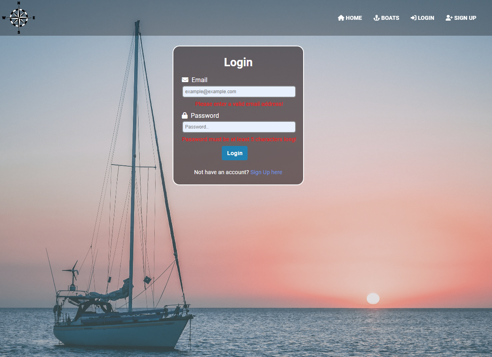

# Boats4U-App-React
This is my project for the React course.

# To install and preview locally, follow these steps:

1. Clone the repository to your local machine
2. Navigate to the server folder to start the server (cd .\server\)
    - Start the server with (node .\server.js) command to start the back-end
3. Navigate to the client folder (cd .\client\)
    - npm install - command for install all packages and dependencies
    - npm run dev - to start the development server and run the app
    - open your browser and go to http://localhost:5173 to access the application

## Application Pages
Home page 

Navigation guests

Navigation private

Footer

About us public part

Sign Up 

Login 

Catalog public part 

Catalog public part details
