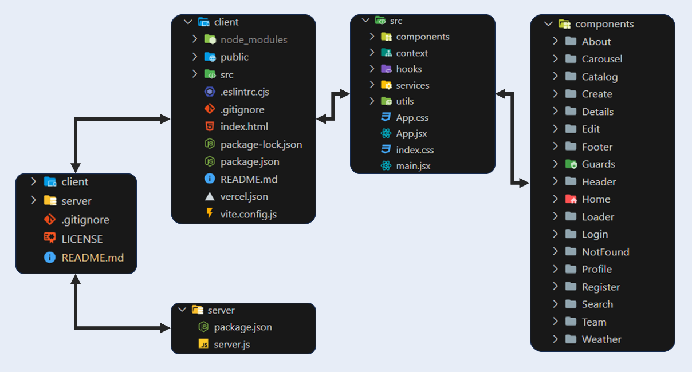

# Project Overview Boats4U 

- Welcome to the Boats4U rental application, where users can embark on unforgettable boating experiences. 
This platform simplifies the process of renting boats and yachts for specific durations at particular prices, facilitating seamless interactions between boat owners and enthusiasts seeking memorable water adventures.

- Logged-in users have the ability to effortlessly create unique offers for their boats or yachts. This empowers boat owners to showcase their vessels' amenities, schedules, and pricing details for potential renters.

- Users navigate an intuitive interface to discover an array of boat trip options suited for their summer vacation desires. They can explore various offers, filtering by preferences such as location, duration, boat type, and price.

- The platform serves as a bridge between boat owners and vacation seekers, allowing users to easily book available offers. It streamlines the booking process, fostering a smooth communication channel between renters and boat owners.

- With a user-friendly interface, this application prioritizes a hassle-free browsing experience. Users can effortlessly browse, select, and book boat trips, making their holiday planning convenient and enjoyable.

- The main goal of this app is to revolutionize the way people plan and experience boating vacations. By providing a centralized boat rental platform, I hope this app will simplify the process, making it accessible, enjoyable and convenient for boat owners and vacationers alike.

- Front end is built using React. For the back-end, i have integrated the application with the SoftUni practice server.

# To install and preview locally, follow these steps:

1. Clone the repository to your local machine
2. Navigate to the server folder to start the server (cd .\server\)
    - Start the server with (node .\server.js) command to start the back-end
3. Navigate to the client folder (cd .\client\)
    - npm install - command for install all packages and dependencies
    - npm run dev - to start the development server and run the app
    - open your browser and go to http://localhost:5173 to access the application

## Project Depoyed
The application is successfully deployed, allowing users to experience its features and functionalities in action.

Deployment Details:
- Project Demo: Explore the live demonstration of my application [Boats4U](https://boats4u.vercel.app/) This interactive demo showcases the seamless user experience, enabling users to navigate, explore boat options, and engage with the platform's features.

- Repository Link: Access the deployed version's code repository on [GitHub](https://github.com/TodorYBorisov/Boats4U-Deployed) This repository holds the deployed codebase, providing transparency and accessibility for developers and contributors.

## Project Structure and Architecture

## Application Pages
Home page 

Navigation guests

Navigation private

Footer

About Us page public part

Sign Up 

Login 

Catalog public page for all user 

Catalog public page details
